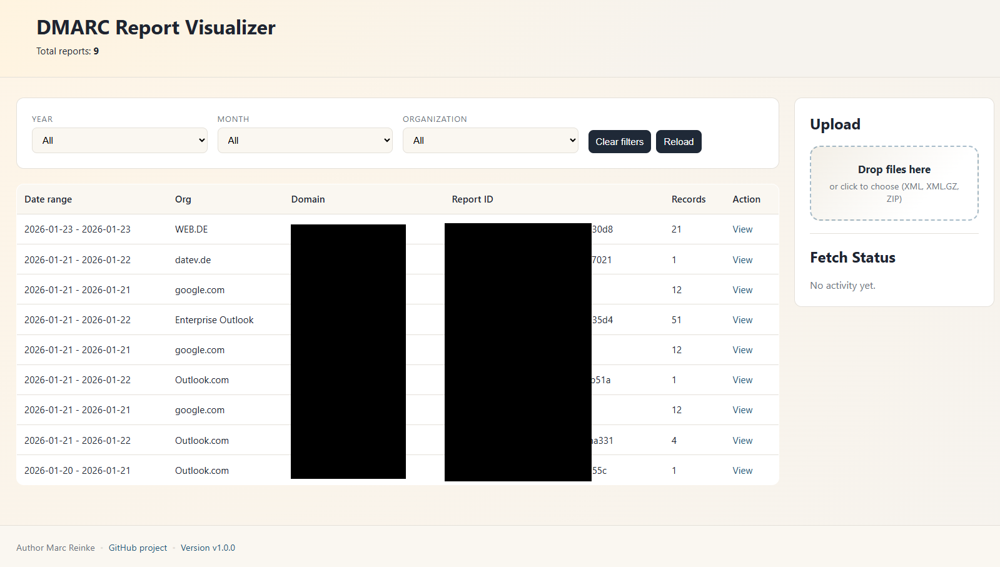

# DMARC Report Visualizer

Small PHP application for ingesting and browsing DMARC aggregate reports. It watches an inbox, extracts supported attachments, stores normalized XML reports under `data/reports/YYYY/MM`, and serves a web UI for listing, filtering, uploading, and inspecting reports.



## Features

- Ingests `.xml`, `.xml.gz`, `.zip`, `.eml`, and `.msg` inputs.
- Extracts DMARC attachments from email messages before processing.
- Organizes stored reports by year and month.
- Provides browser uploads, duplicate detection, live processing status, and report details.
- Supports automatic retention cleanup with `REPORT_RETENTION_MONTHS`.

## Quick Start

Start the default Apache-based runtime:

```bash
docker compose up -d --build
```

The UI is available at `http://localhost:8090`.

For a smaller CLI-based image that uses PHP's built-in web server instead of Apache:

```bash
DOCKER_TARGET=runtime-alpine docker compose up -d --build
```

## How It Works

Place supported files in `./data/inbox`, or upload them through the web UI. The application will:

- extract XML files from ZIP archives
- decompress `.xml.gz` files
- extract DMARC report attachments from `.eml` and `.msg` messages
- move processed XML files into `/data/reports/YYYY/MM`
- update the live status feed during processing
- skip or mark duplicates when the same report was already ingested

The main dashboard also provides:

- report filters by year, month, and organization
- a detail view for individual reports
- upload controls in the sidebar
- a live status list with refresh and dismiss actions

## Data Paths

By default, Docker Compose mounts these local directories into the container:

- `./data/inbox` -> `/data/inbox`
- `./data/reports` -> `/data/reports`

If `/data/...` is not available or writable, the application can fall back to repo-local paths under `./data/`.

## Environment

- `INBOX_DIR` default: `/data/inbox`
- `REPORTS_DIR` default: `/data/reports`
- `STATUS_FILE` default: `/data/status.json`
- `SCAN_INTERVAL_SECONDS` default: `30`
- `REPORT_RETENTION_MONTHS` default: `0` (disabled)
- `DOCKER_TARGET` default: `runtime-apache`

Example `.env`:

```env
REPORT_RETENTION_MONTHS=12
SCAN_INTERVAL_SECONDS=30
```

## Releases

Release history is documented in [changelog.md](changelog.md).
