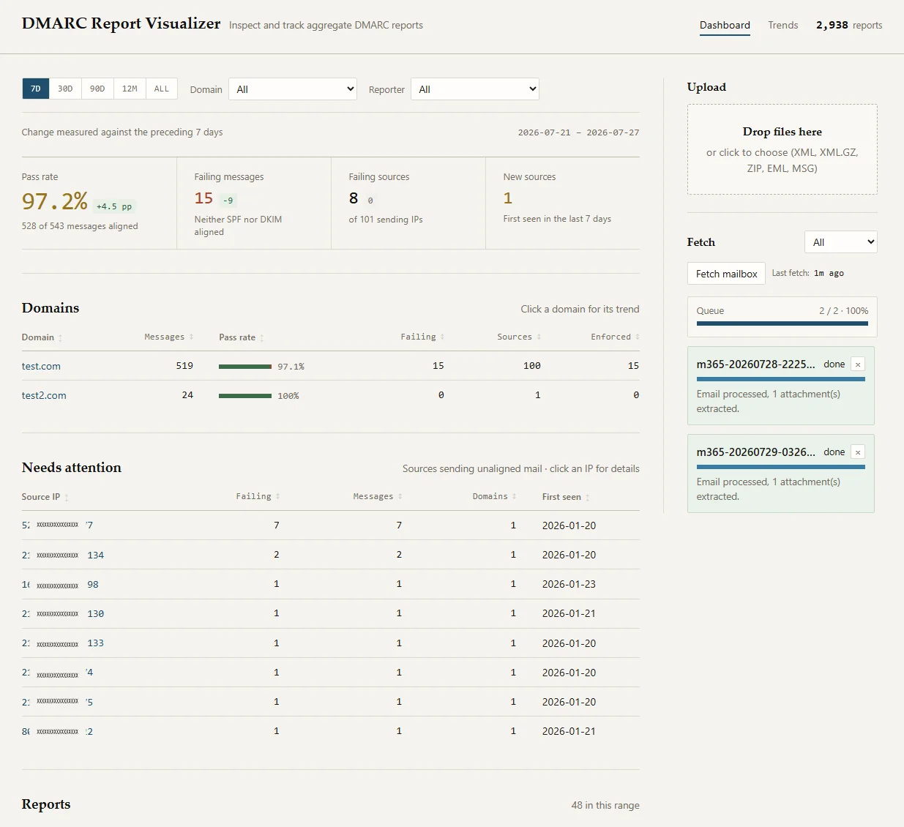
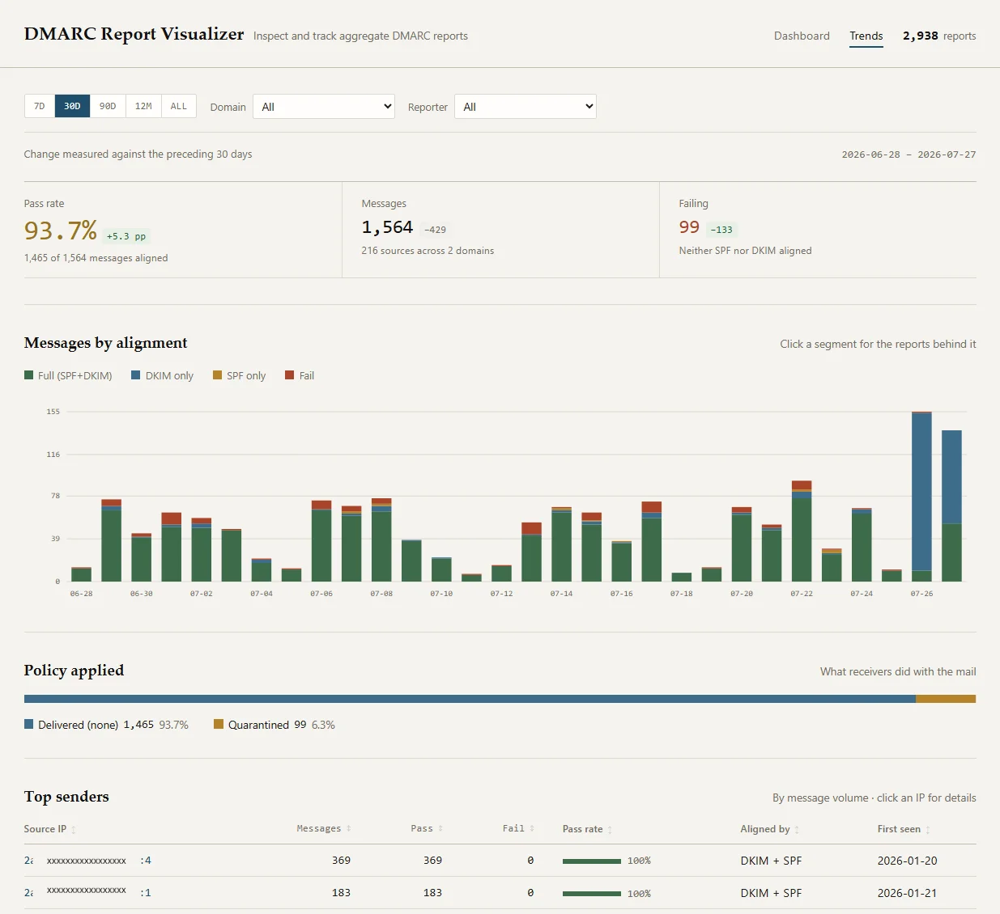
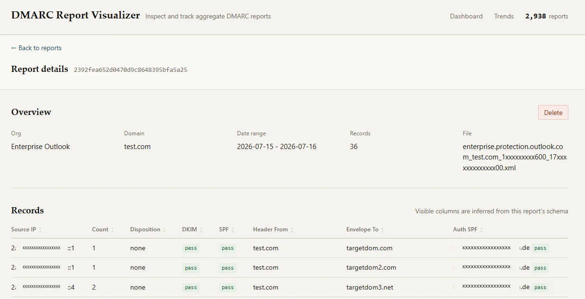

# DMARC Report Visualizer

Small PHP application for ingesting and browsing DMARC aggregate reports. It watches an inbox, extracts supported attachments, stores normalized XML reports under `data/reports/YYYY/MM`, and serves a web UI that answers the two questions the reports are for: is my mail passing DMARC, and who is sending unaligned mail in my name.



## Features

- Ingests `.xml`, `.xml.gz`, `.zip`, `.eml`, and `.msg` inputs, extracting DMARC attachments from email messages.
- Optionally fetches report emails from a mailbox — Microsoft 365 (Microsoft Graph) or any IMAP server.
- A **dashboard** with a health panel, a per-domain table, the sources sending unaligned mail, and the report listing — all under one set of filters.
- A **Trends** view: alignment over time, applied policy, top senders, and a per-sender drilldown.
- Browser uploads with drag and drop, duplicate detection, a live processing status feed, and per-report details.
- A SQLite metadata index for fast listings and aggregates; the XML files stay the source of truth.
- Automatic retention cleanup via `REPORT_RETENTION_MONTHS`.

## Quick Start

Build and run locally:

```bash
docker compose up -d --build
```

Or run the prebuilt image from the GitHub Container Registry:

```bash
docker run -d -p 8090:80 \
  -v "$(pwd)/data/inbox:/data/inbox" \
  -v "$(pwd)/data/reports:/data/reports" \
  ghcr.io/nightbert/dmarc-report-visualizer:latest
```

The UI is then available at `http://localhost:8090`. No configuration is required to start; optional settings are listed under [Environment](#environment). The image is Alpine-based and serves the UI through PHP's built-in web server (~160 MB).

## How It Works

The container runs two parts: a background **worker** that ingests new files on an interval (`SCAN_INTERVAL_SECONDS`, default 30 seconds) and applies retention cleanup, and the **web UI** for uploading and browsing reports.

Place supported files in `./data/inbox`, or upload them through the web UI. The application extracts XML from ZIP archives, decompresses `.xml.gz`, pulls DMARC attachments from `.eml`/`.msg` messages, moves processed XML into `/data/reports/YYYY/MM`, updates the live status feed, and skips or marks duplicates.

Reporters disagree about the report schema, so parsing is deliberately defensive: namespaces are ignored, every field is treated as optional, and missing metadata is derived from the report id or the sending mailbox where possible.

## Filters

Dashboard and Trends share one filter bar: a **time range** (7 days, 30 days, 90 days, 12 months, all time) plus a **domain** and a **reporter** select. A range ends at the newest day covered by the stored reports rather than at today, because aggregate reports arrive days after the fact — the resolved window is printed below the bar. Every change figure ("+4.5 pp", "−9") compares the selected window against the window immediately before it.

## Dashboard

The dashboard opens with a health panel for the selected range: pass rate, failing messages, failing sources, and sources seen for the first time.

Below it, **Domains** lists each reported domain with its volume, pass rate, failing count, distinct sending sources, and how many messages were quarantined or rejected; a domain links into its own trend. **Needs attention** ranks the source IPs sending unaligned mail, with the day each IP was first seen anywhere in the index, so a new sender stands out from a long-known one; an IP links to its drilldown.

**Reports** lists the stored files for the range, sorted and paginated on the server — click a column header to sort the whole set, not just the page. The sidebar holds the actions: a dropzone for uploads and the mailbox fetch button, with the live ingest status feed underneath.

## Trends



The **Trends** view (linked from the header, or at `/trends.php`) aggregates the stored reports:

- headline figures for the range — pass rate, messages, failing — each against the preceding window
- a column chart of message volume by DMARC alignment: full (SPF and DKIM), DKIM only, SPF only, or fail. Clicking a segment lists the reports behind that day and outcome.
- **Policy applied**: what receivers did with the mail — delivered, quarantined, or rejected
- a **top senders** table ranked by volume, showing what each source aligns by and when it was first seen, each source IP linking to a **drilldown** (`/sender.php?ip=...`) with its alignment over time, a per-domain breakdown, and the reports it appears in

Trends runs off the record-level data in the SQLite index, so it stays fast as the collection grows. When the index is unavailable (e.g. the `pdo_sqlite` extension is missing), the view explains that aggregates cannot be shown.

## Report Details



Every listed report opens its own page: the reporting organization, the domain, the covered date range, and the record table. Which columns appear is inferred from what the report actually contains — envelope recipients, policy overrides, and multiple authentication results show up only when a reporter sends them. The raw XML is at the bottom of the page, and a report can be deleted from here.

## Mailbox Fetching

The application can fetch DMARC report emails from a mailbox and drop them as `.eml` files into the inbox, where the normal pipeline picks them up. Two providers are supported: **Microsoft 365** (Microsoft Graph) and **IMAP** (any server, no PHP IMAP extension needed). Fetched messages are marked as read — or deleted, with the `*_DELETE_AFTER_FETCH` option — and only unread messages are polled by default.

The feature is **disabled by default**: set `MAILBOX_FETCH_ENABLED=true` to enable it. `MAILBOX_PROVIDER` (`auto`/`m365`/`imap`) selects the provider, `MAILBOX_POLL_INTERVAL_SECONDS` controls automatic polling (`0` = fetch only via the dashboard's **Fetch mailbox** button), and a lock prevents concurrent fetches. All provider settings are under [Environment](#environment).

For **Microsoft 365**, set up an app registration in Entra ID:

1. Create an app registration (single tenant) and a client secret.
2. Add the **application** permission `Mail.ReadWrite` (Microsoft Graph) and grant admin consent — required to mark messages read or delete them.
3. Recommended: restrict the app to the report mailbox with an [application access policy](https://learn.microsoft.com/en-us/graph/auth-limit-mailbox-access), since application permissions otherwise cover all mailboxes.

## Data & Index

Docker Compose mounts `./data/inbox` and `./data/reports` into the container; if `/data/...` is not writable, the app falls back to repo-local paths under `./data/`.

A SQLite metadata index at `<reports dir>/.report-index.sqlite` (override with `REPORT_INDEX_FILE`) caches fingerprints, summary metadata, and a record-level table for the dashboard panels and Trends, so listings, aggregates and duplicate checks avoid re-parsing every XML file. It reconciles itself with the files on disk: deleting it or changing files manually is safe — it rebuilds on the next ingest run, and manual changes appear within one cycle. Without `pdo_sqlite`, the app falls back to scanning the XML files (the aggregate views are then unavailable).

## Environment

| Variable | Default | Description |
| --- | --- | --- |
| `INBOX_DIR` | `/data/inbox` | Inbox directory. |
| `REPORTS_DIR` | `/data/reports` | Stored reports directory. |
| `STATUS_FILE` | `/data/status.json` | Live status feed file. |
| `REPORT_INDEX_FILE` | `<reports dir>/.report-index.sqlite` | SQLite index location. |
| `SCAN_INTERVAL_SECONDS` | `30` | Seconds between worker ingest runs. |
| `REPORT_RETENTION_MONTHS` | `0` | Delete reports older than N months (`0` = keep forever). |
| `MAILBOX_FETCH_ENABLED` | `false` | Master switch for mailbox fetching. |
| `MAILBOX_PROVIDER` | `auto` | `auto` \| `m365` \| `imap`. |
| `MAILBOX_POLL_INTERVAL_SECONDS` | `0` | Auto-poll interval in seconds; `0` = UI button only. |
| `MAILBOX_STATE_FILE` | `/data/mailbox-state.json` | Stores the last-fetch time shown in the UI. |

Microsoft 365 (all four credentials required to enable):

| Variable | Default | Description |
| --- | --- | --- |
| `M365_TENANT_ID` / `M365_CLIENT_ID` / `M365_CLIENT_SECRET` / `M365_MAILBOX` | empty | Graph app + target mailbox. |
| `M365_FOLDER` | `Inbox` | Folder (well-known or display name). |
| `M365_DELETE_AFTER_FETCH` | `false` | `true` moves to Deleted Items instead of marking read. |
| `M365_MAX_MESSAGES` | `25` | Page size (max 100); all pages are fetched. |

IMAP (host, username, password required to enable):

| Variable | Default | Description |
| --- | --- | --- |
| `IMAP_HOST` / `IMAP_USERNAME` / `IMAP_PASSWORD` | empty | Connection and credentials. |
| `IMAP_PORT` | `993` / `143` | `993` for ssl, otherwise `143`. |
| `IMAP_ENCRYPTION` | `ssl` | `ssl` \| `starttls` \| `none`. |
| `IMAP_VALIDATE_CERT` | `true` | `false` accepts self-signed certificates. |
| `IMAP_FOLDER` | `INBOX` | Folder to fetch from. |
| `IMAP_DELETE_AFTER_FETCH` | `false` | `true` deletes and expunges; `false` marks read. |
| `IMAP_FETCH_ALL` | `false` | `true` fetches all messages, not only unread. |
| `IMAP_MAX_MESSAGES` | `25` | Max messages per run, newest first. |

Set these in a `.env` file beside `docker-compose.yml`, or in the compose `environment:` block.

## Releases

A multi-architecture image (amd64/arm64) is published to `ghcr.io/nightbert/dmarc-report-visualizer` on every tagged release (`vX.Y.Z`), tagged with the version and with `:latest` pointing at the newest release. Version history is in [changelog.md](changelog.md).
